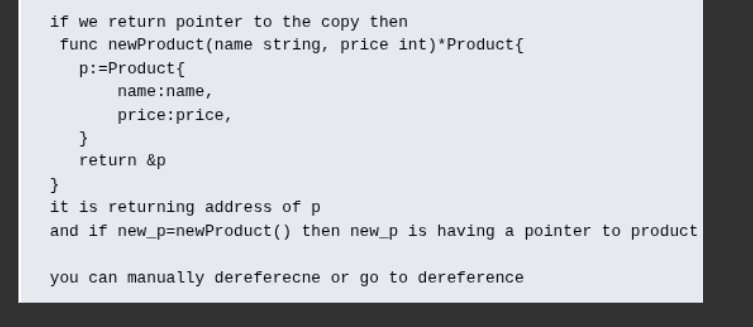
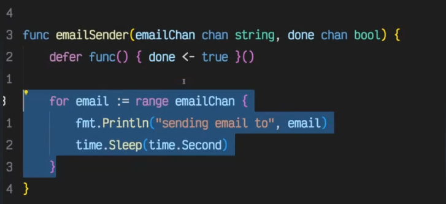

## jo shorthand syntax hai usko func ke bahar declare ni kr skte ho but u can declare full syntax

##Yes. make allocates and initializes the internal data structures needed by certain Go types.

- For maps:

- m := make(map[string]string)

- Go creates an empty map and returns a reference to it. After that, you can safely insert values:

- m["key1"] = "value1"

##Yes.
```

In Go, _ is called the blank identifier. You can use it when you want to ignore a value.

Example 1: Ignore a return value
func getData() (string, int) {
    return "hello", 42
}

func main() {
    msg, _ := getData()
    fmt.Println(msg)
}
```

##range
```
For strings:

for i, c := range s
i = starting byte index of the rune
c = rune (Unicode code point)
range automatically decodes UTF-8 characters
English letters are usually 1 byte each
Many non-English characters (Hindi, Chinese, emojis) occupy multiple bytes, so indices may jump (0, 3, 6, ...)

This is one of the reasons Go uses UTF-8 strings by default and provides rune to work correctly with
```
## closure
```
Why isn't `count` destroyed when `counter()` returns?

Normally, local variables are associated with a function's stack frame. However, Go performs escape analysis.

The compiler sees that `count` is used by a function that outlives `counter()`.

Because of that, `count` cannot safely remain only on the stack.

The compiler moves `count` to the heap (or otherwise ensures it remains valid).

The returned closure holds a reference to that variable.

So after counter() returns, the stack frame may be gone, but the captured variable still exists because something (the closure) still references it.


```

# why closures are in heap
```
go step by step
1) first 
increment:=counter()
here increment is getting the inner function which is count+=1 if we are storing count in stack means it gets destroyed already and count is not declared yet
and when we run it it will give error
so one thing we can do is if we keep count variable inside the func it will not give error or putting the count variable in heap

```

## Pointers are basically memory address

```
The Goal (*Product): Look at the function signature: func newProduct(...) *Product. The * indicates that this function promises to return a pointer to a Product. It is essentially saying, "I won't give you the actual Product data directly; I will give you the location of where to find it."

The Variable (p): Inside the function, you create p. When the computer creates p, it stores that Product data somewhere in the computer's physical memory (RAM).

The Address (&p): The & symbol is the "address-of" operator. When you type &p, you are asking the computer, "What is the memory address where p is currently sitting?" Because a pointer's entire job is to hold memory addresses, returning the address of p (&p) perfectly satisfies the function's promise to return a pointer (*Product).
```

## receiver
```
In Go, there are no "classes." Instead, you can attach functions to structs (turning them into "methods") by using a special syntax called a receiver.

```


## concurrency using routines and waitgroups
```
Step 3: The Correct Way (Using WaitGroups)
To make goroutines work properly, we need a way to tell the main function to wait for the background tasks to finish before exiting. We do this using a sync.WaitGroup.

Think of a WaitGroup as a counter. You add 1 for every goroutine you launch, and each goroutine subtracts 1 when it finishes. main simply waits until the counter hits zero.

When you run normal code in languages like Java or C++, a new thread maps directly to an OS (Operating System) thread. OS threads are heavy and take a lot of memory to set up.

Go does not do this. Go has its own internal Scheduler. The Go runtime asks the OS for a few heavy threads (usually equal to the number of CPU cores you have), and then Go multiplexes (juggles) your thousands of lightweight goroutines across those few heavy OS threads. If one goroutine stops to wait for a network request or a time.Sleep, the Go Scheduler instantly swaps it out and puts another active goroutine on the CPU.

```

### channels
```
Before you can use a channel, you must create it using the make keyword. You must also strictly define what type of data will flow through it.

Go
// Unbuffered channel (Direct hand-off, 0 capacity)
unbufferedChan := make(chan string)

// Buffered channel (Mailbox with a capacity of 3)
bufferedChan := make(chan int, 3)

closing
This is a crucial step we haven't covered yet! When a goroutine is completely finished sending data, it should close the channel. This acts as a signal to the receiver that says, "I am done, don't wait for any more data."

Go
close(unbufferedChan)
Two Golden Rules of Closing:

Only the SENDER should close the channel. If a receiver closes a channel while the sender is still trying to push data into it, the program will crash (panic).

You don't always have to close channels. The Go garbage collector will clean them up if they are no longer being used. You only explicitly close them when you need to tell the receiver that the work is finished.
Summary of the Golden Rules
To keep it perfectly clear in your head, just remember these two rules:

The Sender: Only gets blocked if the channel is 100% FULL (or has 0 capacity).

The Receiver: Only gets blocked if the channel is 100% EMPTY.

As long as the buffer is somewhere in the middle (like 1/2 or 1/100), both the sender and the receiver can run simultaneously at full speed!


```



```
That is a brilliant question, but the answer is no, you absolutely do not need to do that! The reason you don't need to manually write <-emailChan 100 times is because that is exactly what the range loop is already doing for you under the hood.

Here is exactly why the buffer is already empty the moment the loop finishes:

1. range is an Automatic Sucker
When you write for email := range emailChan, you are not just "looking" at the channel. You are actively pulling data out of it.

Every single time that loop spins, it executes a hidden <-emailChan command.

Loop 1: It sucks out email 0. (Buffer has 99 left)

Loop 2: It sucks out email 1. (Buffer has 98 left)

...

Loop 100: It sucks out email 99. (Buffer is now 0)

By the time the range loop finishes and breaks, it has systematically sucked the channel completely dry.


```

## if we close channel
```
The Rule of close()
Calling close(emailChan) only does one thing: It permanently locks the "Send" door.
If any goroutine tries to send new data (emailChan <- "late_email") into a closed channel, the entire program will crash with a panic: send on closed channel.

However, the "Receive" door remains wide open.

2. How the range loop handles it
Let's say the Main function pumped 100 emails into the buffer, and then instantly called close(emailChan).

Meanwhile, the background worker has only processed 2 emails. There are 98 emails left in the closed pipe.
Here is what the range loop does:

It sees the channel is closed.

It says: "Okay, no new data will ever arrive, but I still see 98 items in the buffer."

It continues to loop, pulling out item 3, 4, 5... all the way to 100.

Once it pulls out item 100, it checks the buffer again. It sees the buffer is empty AND the channel is closed.

Now it finally breaks the loop and exits.

3. How to check it manually (Without range)
If you aren't using a range loop and are pulling data out manually, Go provides a special "two-variable" syntax to let you check if a channel is both empty and closed:

Go
// 'email' gets the data. 
// 'ok' is a boolean that is true if the data is valid, 
// and false if the channel is empty AND closed.

email, ok := <-emailChan

if ok == false {
    fmt.Println("Channel is empty and closed! Time to go home.")
} else {
    fmt.Println("Received:", email)
}


```

## typesafety in channels
```
in parameters wruite emailchain<-chan string

```